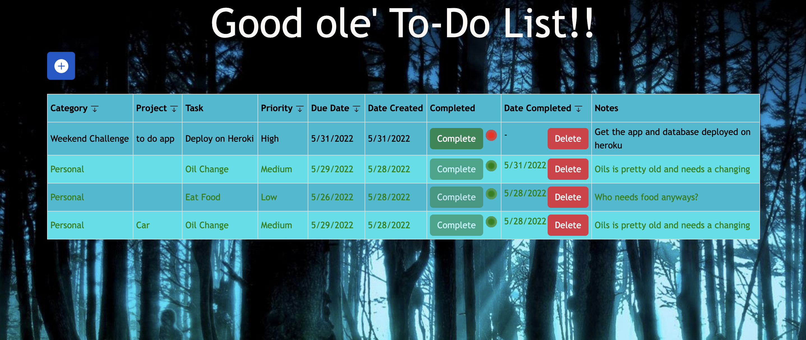

# Project Name
To-do List

## Description

_Duration: 20 hours_

I made a to-do list app that utilizes client, server, and a database. Doing so gives you the ability to for long term storage with-in this to-do list app. 
This app tracks with category, project, task name, priority, due date, date created, is it complete, date completed, and a spot for notes.

To see fully functional site please visit: [SQL TODO APP](https://lit-headland-90246.herokuapp.com/)

## ScreenShot
 

### Prerequisites

Link to software that is required to install the app (e.g. node).

- [Node.js](https://nodejs.org/en/)
- [Postgres](https://postgresapp.com/)
- [Postico](https://eggerapps.at/postico/)

## Installation

Fork and clone the repo

1. Create a database named 'weekend-to-do-app'
2. Open editor of choice
3. run `npm install`
3. Run the sql commands in database.sql to set up your table
4. run `npm start`
5. open a browser and visit `localhost:5000`

## Usage

1. Click the square with a + on it
2. Add in task name and due date the the only required ones.
3. Add Task
4. Once a task is complete click the complete button
5. If you no longer need the completed task feel free to hit the delete button to get rid of it

## Acknowledgement
Thanks to [Prime Digital Academy](www.primeacademy.io) who equipped and helped me to make this application a reality.

## Support
If you have suggestions or issues, please email me at [joeylundquist91@gmail.com]
